# ControlDeck

[](https://github.com/Rishidar-lab/controldeck/actions/workflows/ci.yml)

**Multi-agent orchestration is not governance.**

Agents propose. Evidence is assessed. Deterministic governance decides what
transitions are legal. Human approval binds authority where required.
Execution is controlled. Postconditions determine success. Audit
reconstructs what happened.

ControlDeck is a from-scratch TypeScript system that makes that boundary
real, testable, and visible — not a design doc, a working monorepo with
276 passing tests, a live operator UI, and a 30-case adversarial evaluation
corpus run against it.

---

## 1. Problem

Give an LLM agent a goal and a set of tools, and it will confidently narrate
success. It will also confidently hallucinate evidence, approve its own
actions, retry a side-effecting call it can't tell already succeeded, and
describe an event in the audit log as if it were the one who authored it.
None of that is a model-quality problem. It's an **architecture** problem:
somewhere between "the agent thinks this is a good idea" and "a privileged
system call actually happens," something has to be able to say no — reliably,
deterministically, and in a way a human can audit afterward. Most agent
frameworks don't have that layer. ControlDeck is that layer, built and
tested in isolation from any particular agent framework.

## 2. Core principle

```
CLAIM  !=  EVIDENCE  !=  VERIFIED FACT
ADVISORY (model output)  !=  AUTHORITATIVE (system decision)
EXECUTION ATTEMPTED  !=  EXECUTION PROVEN
```

Every value in ControlDeck is either **Advisory** (something a specialist
agent proposed — untrusted, unstructured until validated, never itself
authority) or **Authoritative** (something deterministic code decided). The
two are never merged into one generic "assistant said so" blob, and the UI
never lets you forget which one you're looking at (see [§4](#4-agent-roles--contracts),
[§13](#13-security-invariants)).

## 3. Architecture

Ten independently-typechecked packages, each owning exactly one boundary in
the pipeline. No package reaches past its own layer — governance never reads
raw evidence text, execution never reads agent rationale, audit entries are
never authored by anything but the ledger's own `append()`.

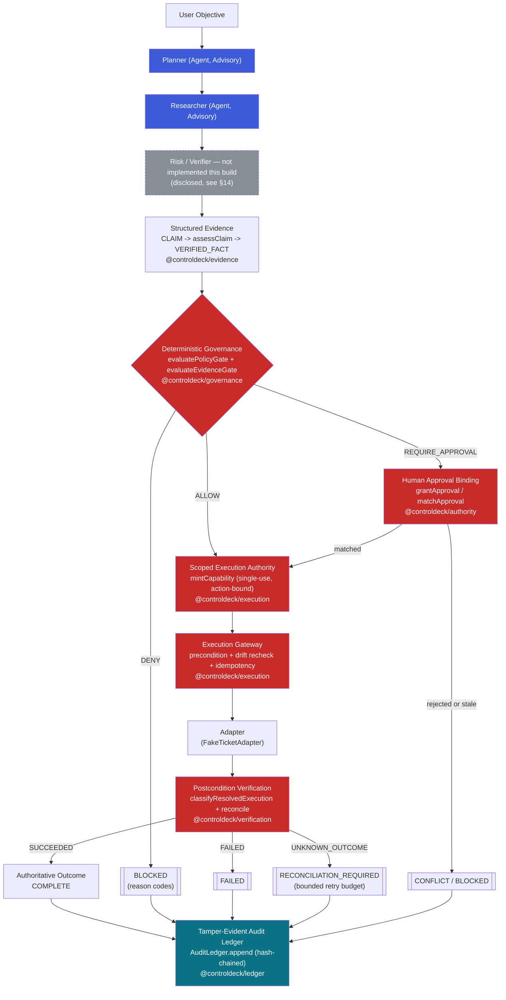

Blue = Advisory (model output). Red = Authoritative (deterministic system
decision). Teal = permanent record. Grey/dashed = disclosed gap, not built
this round. Nothing blue ever points directly at an adapter, a state
transition, an audit entry, or an authority grant — every arrow out of a
blue box first passes through a red box.

| Package | Role |
|---|---|
| `@controldeck/contracts` | Single source of truth for state/trigger/reason-code/event vocabulary (Zod, `.strict()`) |
| `@controldeck/domain` | Workflow state machine (`transition()`), canonical hashing, clock/id abstractions — pure, no I/O |
| `@controldeck/evidence` | CLAIM → EVIDENCE → VERIFIED FACT (`assessClaim`) |
| `@controldeck/governance` | Deterministic ALLOW / DENY / REQUIRE_APPROVAL over structured inputs only |
| `@controldeck/agents` | Planner + Researcher specialist proposal layer — output is `unknown` until schema-validated |
| `@controldeck/authority` | Human approval binding (`grantApproval` / `matchApproval`) — authority state only, no execution |
| `@controldeck/execution` | The only legitimate path to a privileged adapter call — capability minting, precondition/drift recheck, idempotency |
| `@controldeck/verification` | Execution attempted is NOT execution proven — postcondition classification, reconciliation, bounded retry |
| `@controldeck/ledger` | Append-only, hash-chained, server-authored audit ledger + replay/projection |
| `@controldeck/web` (`apps/web`) | Operator UI — the governance boundary made visible |

## 4. Agent roles / contracts

Two specialists are implemented and wired end-to-end: **Planner** (proposes
a plan) and **Researcher** (returns evidence records). Both run under a hard
provider timeout, and both produce `unknown` output until it is parsed
against a `.strict()` Zod schema in `@controldeck/contracts` — a specialist
cannot inject an extra field to smuggle authority through validation.
**Risk** and **Verifier** are modeled in the UI's type system and rendered
as explicitly "not implemented" — see [§14](#14-known-limitations). No
specialist output — validated or not — can construct a `WorkflowState`
transition, an `Approval`, a `Capability`, a governance decision, an
execution result, or an audit event. Those types have exactly one
constructor each, and none of them live in `@controldeck/agents`.

## 5. Evidence model

```
CLAIM        — a specialist's assertion (Advisory)
EVIDENCE     — a retrieved record backing a claim (Advisory)
VERIFIED_FACT — assessClaim's structural verdict (Authoritative)
```

`assessClaim` checks **provenance, integrity, and freshness** — tenant
match, content-hash match against the retrieved record, snapshot recency —
deterministically and with no model call. It is deliberately **not** a
semantic truth-checker; see [§14](#14-known-limitations) for the exact
boundary and why it was left there on purpose rather than faked.

## 6. Governance model

`evaluatePolicyGate` and `evaluateEvidenceGate` read only structured inputs
— verified claim assessments, risk classifications, tool/composition
rules — never raw evidence text or agent rationale prose. Output is always
one of `ALLOW` / `DENY` / `REQUIRE_APPROVAL` plus an explicit set of reason
codes (30 defined in `@controldeck/contracts`, each traceable to a
corpus case or disclosed as an intentional addition — see the code comment
in `packages/contracts/src/index.ts`). A workflow with zero evidence
assessments cannot reach `SATISFIED` — proven by this build's final
mutation test ([§12](#12-evaluation)).

## 7. Human authority

An `Approval` binds a specific human decision to a specific plan hash,
evidence-snapshot hash, and action hash. `matchApproval` re-checks all
three at consumption time: if the plan changed, the evidence snapshot
changed, or the action changed since the approval was granted, the approval
does not transfer — it fails closed with `SNAPSHOT_CHANGED` /
`APPROVAL_INVALIDATED`, never silently re-authorizing a different action
under an old human "yes."

## 8. Execution boundary

`executeAction` is the **only** function in the codebase permitted to call
an adapter. Before it does, it re-checks preconditions against current
state (not the state at plan time — drift is checked explicitly), mints a
single-use, action-bound `Capability` via `mintCapability`, and enforces
idempotency by operation key so a retried request cannot produce a second
side effect. There is no adapter-bypass path — proven by a dedicated
adversarial test suite in `packages/execution/src/execute.test.ts`.

## 9. Verification / UNKNOWN_OUTCOME

An adapter call resolving does not mean it *succeeded*. `classifyResolvedExecution`
produces exactly one of `SUCCEEDED` / `FAILED` / `UNKNOWN_OUTCOME` from the
adapter's receipt shape and declared postconditions — never from narration.
`UNKNOWN_OUTCOME` (e.g. a timeout with no confirmed receipt) routes to
`RECONCILIATION_REQUIRED`, a read-only reconciliation pass, and a bounded
`RetryBudget` — a workflow can never blind-retry a side-effecting call
forever on ambiguous results.

## 10. Conflict handling

Two verified assessments of the **same claim** with different verdicts is a
deterministic conflict (`CONTRADICTED_EVIDENCE`) — never resolved by
majority vote, "latest wins," or picking whichever agent sounded more
confident. A stale/invalidated approval reaching execution is a conflict
too (`CONFLICT` state, `SNAPSHOT_CHANGED` / `APPROVAL_INVALIDATED`). The
Conflict view always shows the disagreement **and** the fixed rule that
resolved it — never a vote tally.

## 11. Audit / replay

`AuditLedger.append()` is server-authored and hash-chained: every entry
records the previous entry's hash, so any edit to history breaks
`verifyLedgerIntegrity()`'s chain check (this build's Gate-8 mutation
test proves it, and w4-013 exercises it end-to-end). A model may
*contribute payload content* (e.g. a plan id) but never chooses an
entry's type, sequence number, or hash — `packages/ledger/src/authorship.test.ts`
proves a payload that itself claims to *be* a `WORKFLOW_COMPLETED` event
has zero effect on the entry's real, system-computed fields.
`projectWorkflow` reconstructs a workflow's terminal state purely by
replaying recorded events — it never re-runs an agent or an adapter. See
[§14](#14-known-limitations) for the one open gap in this layer
(`REPLAY_PROJECTION` reason-code semantics).

## 12. Evaluation

The full 30-case Week-4 adversarial corpus (`06-week4-evaluation/evaluation_corpus.json`)
was run against the current codebase by composing the real package
functions per case and comparing the resulting terminal state + reason
codes to each case's expected outcome. No expected outcome was ever
changed to inflate the pass count.

> Note: the corpus JSON (`06-week4-evaluation/evaluation_corpus.json`) is part of
> the Week-4 freeze submission package and is **not committed to this repository**.
> The per-gate behaviors each case exercises are covered by the committed package
> unit tests (`packages/*/src/*.test.ts`); the honest case-by-case results are in
> [`docs/EVALUATION.md`](docs/EVALUATION.md).

| | Count |
|---|---|
| Total cases | 30 |
| Executed | 26 |
| **PASS** | 19 |
| **PARTIAL** | 2 |
| **FAIL** | 5 |
| **NOT_APPLICABLE** | 4 |

Full case-by-case table and root-cause classification for every FAIL/PARTIAL:
[`docs/EVALUATION.md`](docs/EVALUATION.md). Every gate's build included a
deliberate mutation test — a real regression introduced, proven to break a
real test, then reverted — never left in the codebase. The final
cross-cutting one: removing the "missing evidence assessment" rejection
from `evaluateEvidenceGate` turned red 3 tests, including a real
state-machine integration test that would otherwise have let a workflow
with **zero evidence on file** advance past `EVIDENCE_ASSESSED`.

## 13. Security invariants

| | |
|---|---|
| Model may authorize | **NO** |
| Model may move workflow state | **NO** |
| Model may declare a verified fact | **NO** |
| Model may mint execution authority | **NO** |
| Model may execute an adapter directly | **NO** |
| Model may declare execution success | **NO** |
| Model may author an audit entry's system fields | **NO** |
| Agent vote/consensus may authorize | **NO** |
| Unverified evidence may satisfy governance | **NO** |
| Stale evidence may satisfy governance | **NO** |
| Changed plan may reuse an existing approval | **NO** |
| Changed evidence snapshot may reuse an existing approval | **NO** |
| Duplicate side effect possible via retry | **NO** |
| Blind retry on `UNKNOWN_OUTCOME` possible | **NO** (bounded `RetryBudget`) |
| Tampered ledger entry verifies as clean | **NO** |

Every row above is backed by a named test, not an assertion in this
document — see [`docs/EVALUATION.md`](docs/EVALUATION.md)'s adversarial
coverage list for the exact test/case per row.

## 14. Known limitations

These are disclosed design boundaries, not bugs found and left unfixed.
None was patched over to force a passing evaluation number.

- **Semantic evidence verification is out of scope.** `assessClaim`
  verifies structural provenance/integrity/freshness only — it never
  judges whether a claim's text is *true*. `STRUCTURALLY VERIFIED EVIDENCE
  != SEMANTICALLY TRUE CLAIM`, always. This is why w4-003, w4-014, and
  w4-017 (each expecting semantic-content rejection, e.g. "evidence text
  contains an embedded instruction") report FAIL rather than being faked
  with a generic LLM-as-judge bolted on to flip the number.
- **No live orchestrator/executor server exists yet.** Every gate's
  primitives are real, composable, and independently tested, but nothing
  in this build wires them into one end-to-end request-driven service.
  Two evaluation cases (w4-004, w4-026) depend on an Executor/orchestrator
  contract that was never built; both are reported FAIL rather than
  simulated. `packages/ledger/src/authorship.test.ts` independently proves
  w4-026's underlying invariant *more strongly* than the corpus's literal
  expected mechanism (structural impossibility vs. detect-and-reject) — but
  since it doesn't reproduce the literal observable, it is not counted as
  a pass.
- **Risk and Verifier specialists are not implemented.** Planner and
  Researcher are real; Risk and Verifier are modeled in the UI's type
  system and explicitly labeled "not implemented" rather than mocked.
- **`REPLAY_PROJECTION` reason-code semantics are spec-ambiguous
  (w4-012).** `projectWorkflow` correctly reconstructs terminal state
  from recorded events, but no code path returns that string as a reason
  code — it reads more like a label for the *act* of calling a replay
  endpoint than a value any function emits. Left PARTIAL, unresolved.
- **w4-023's exact reason-code set is a superset of the literal
  expectation** (`FORBIDDEN_TOOL` + `COMPOSITION_VIOLATION` vs. just
  `FORBIDDEN_TOOL`) because `evaluatePolicyGate` treats every
  forbidden-tool attempt as definitionally a composition violation too —
  terminal state matches exactly; reported PARTIAL rather than forced to
  match.
- Several internal source comments reference planning documents under
  `submission/week4/` (e.g. `ARCHITECTURE.md`, `AGENT_CONTRACTS.md`,
  `AUTHORITY_MODEL.md`, `EVIDENCE_MODEL.md`, `EVALUATION_PLAN.md`,
  `API_SPEC.md`) that were used during design but were never themselves
  committed as standalone files in this repository — their content is
  reflected in the code, its tests, and this README instead.

## 15. Setup

Requires Node ≥ 22 and `pnpm@10.34.5` (pinned via `packageManager`).

```bash
git clone <repository-url> controldeck
cd controldeck
pnpm install
```

## 16. Testing

```bash
pnpm test          # full vitest suite (276 tests)
pnpm typecheck      # tsc --noEmit across all 10 packages
pnpm lint            # eslint .
pnpm build          # production build (apps/web)
pnpm audit           # pnpm audit --prod
pnpm secret-scan     # zero-dependency scan over git-tracked files
```

## 17. Demo

**Demo video:** https://github.com/Rishidar-lab/controldeck/releases/tag/week4-demo-v1 (Scenarios A–D, narrated, ~2:45)

```bash
pnpm --filter @controldeck/web dev
```

Open the printed local URL. The scenario picker at the top switches between
6 hero scenarios (A–F), each composing the real `@controldeck/*` packages
live in the browser — no hard-coded demo state. See
[`submission/week4/DEMO_SCRIPT.md`](submission/week4/DEMO_SCRIPT.md) for a
narrated 90–120s walkthrough and
[`submission/week4/FINAL_RECORDING_SHOTLIST.md`](submission/week4/FINAL_RECORDING_SHOTLIST.md)
for the exact shot list.

| Panel | Screenshot |
|---|---|
| 1. Intake | 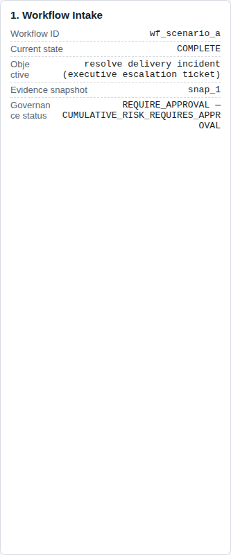 |
| 2. Specialist Outputs (Advisory) | 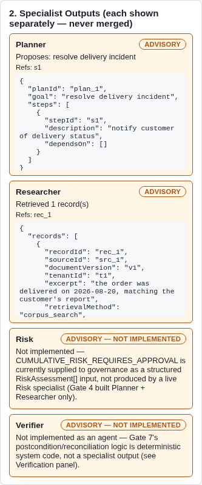 |
| 3. Evidence (Claim → Evidence → Verified Fact) | 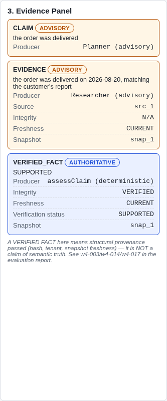 |
| 4. Governance Decision (Authoritative) | 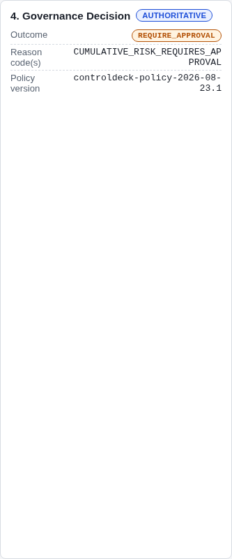 |
| 5. Approval Binding | 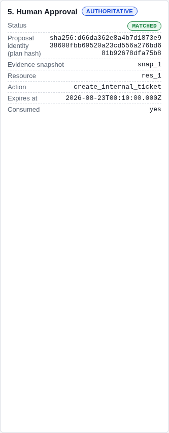 |
| 6. Execution | 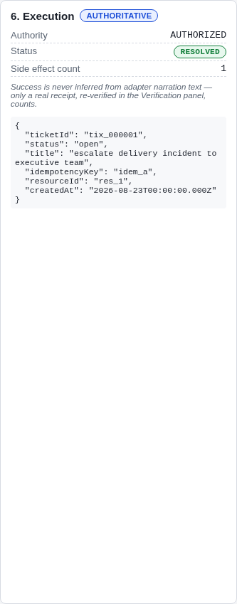 |
| 7. Verification | 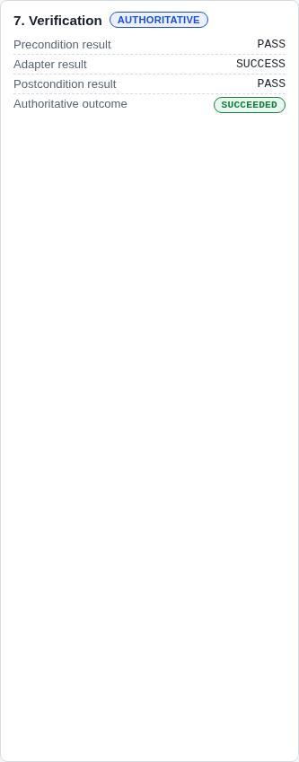 |
| 8. Audit Timeline | 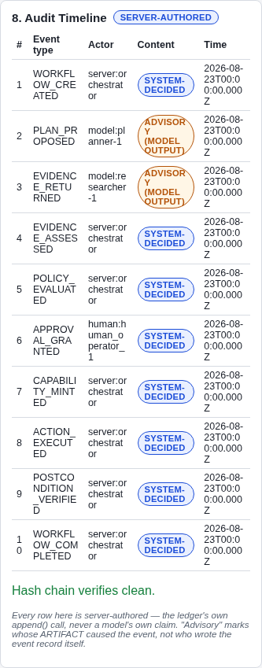 |
| 9. Conflict State | 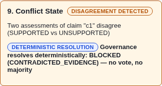 |
| 10. Replay / Projection | 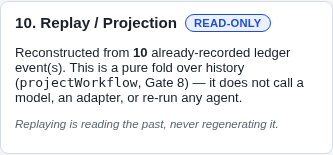 |

Captured live from the running app (Playwright + system Chrome) at
390 / 768 / 1024 / 1440px — zero console errors, zero horizontal overflow,
zero secret/capability-token leakage at every breakpoint
(`docs/screenshots/qa-full-*.png`).

## 18. Repository structure

```
controldeck/
├── packages/
│   ├── contracts/       state/trigger/reason-code/event vocabulary (Zod)
│   ├── domain/          state machine, canonical hashing, clock/id, SHA-256
│   ├── evidence/        CLAIM -> EVIDENCE -> VERIFIED FACT
│   ├── governance/      deterministic policy + evidence gates
│   ├── agents/          Planner + Researcher specialist proposal layer
│   ├── authority/       human approval binding
│   ├── execution/       capability minting, execution gateway, adapters
│   ├── verification/    postcondition classification, reconciliation, retry
│   └── ledger/          hash-chained audit ledger, replay/projection
├── apps/
│   └── web/             operator UI — 10 panel views, 6 hero scenarios
├── docs/
│   ├── EVALUATION.md    full Gate-10 evaluation report
│   └── screenshots/     real, captured-live UI screenshots
├── submission/week4/    demo script, shot list, narration, freeze record
└── scripts/
    └── secret-scan.mjs
```

---

Built gate-by-gate (Gate 0 through Gate 12), each gate shipped with real
running code, a full quality-gate pass, a deliberate mutation test proving
the test suite has teeth, and one detailed commit. See `git log` for the
complete build history.
